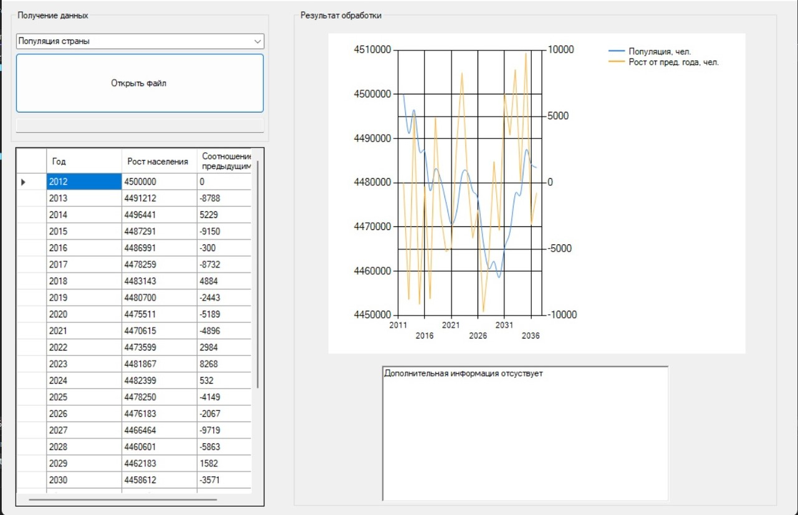

# Технологии программирования. **3-я лаба**

Участники: Мацуев А.Д, Вишняков М.В.

## Функционал команд

### Туристический поток

- **Задание:** Пользователь открывает файл с данными о туристском потоке в России за последние 15 лет. Вывести эту информацию на экран в удобном формате. Также по этим данным построить графики. Вычислить из какой страны за последние 15 лет приезжало больше всего людей.

- **Формат входных данных:** ```год; турпоток из Европы; турпоток из Азии; турпоток из Америки; турпоток из Австралии```
    
  	> *Пример:*
	>
  	> 2008;2,56;1,23;2,29;0,21
	>
	> 2009;2,00;2,10;2,21;0,40
	> 
	> ...

### Численность населения РФ

- **Задание:** Пользователь открывает файл с данными о миграции населения России за последние 15 лет (число иммигрантов и число эмигрантов). Вывести эту информацию на экран в удобном формате. Также по этим данным построить графики. Вычислить ежегодный процент изменения миграции.

- **Формат входных данных:** ```год; население```
    
  	> *Пример:*
	>
  	> 2012;4500000
	>
	> 2013;4491212
	> 
	> ...

- **Пример работы:**

	
